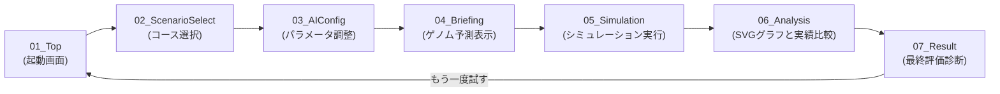

# Evodrive AI - Figma UI設計仕様書

本仕様書は、自律走行AI進化シミュレーター『Evodrive AI』のUI/UXをFigmaで再現・設計・維持するための公式デザインガイドラインです。

---

## 1. デザインコンセプト

**「SFネオン・フューチャリスティック x 精密なデータ分析（Cyber-Data Aesthetics）」**
*   **ダークモード優先 (Dark-First)**: 深い宇宙やサイバー空間を想起させるダークカラー背景を採用し、ディスプレイからの光による疲労を最小限に抑えます。
*   **ネオンアクセント (Neon Accents)**: シアン（Cyan）、パープル（Purple）、イエロー（Yellow）、レッド（Red）のネオンカラーを明示的なアクションやステータス表示に配し、コントラストを高めます。
*   **グラスモルフィズム (Glassmorphic Panels)**: 半透明のパネル（微細なブラー効果と極薄のアウトライン）により、レイヤーの奥行きとモダンでプレミアムな質感を演出します。
*   **精密なデータレイアウト (Precise Data Display)**: チャート、テレメトリ、スタッツ類は端正な等幅フォントとグリッドを用いて整理し、科学的かつ知的な印象を与えます。

---

## 2. ターゲットユーザー

1.  **AI技術・自動運転に興味を持つ開発者 / エンジニア**
    *   ビジュアルの美しさと同時に、定量的なデータ推移（スコアやクラッシュ率の変化）を素早く正確に読み取れるUIを求めます。
2.  **体験的学習を求める学生・教育関係者**
    *   直感的で迷わない遷移（ステップバー、明確なCTAボタン）と、AIの挙動変化が視覚的にわかりやすいUIが必要です。

---

## 3. 画面遷移と各画面の目的

---

## 4. 各画面の詳細・主要UI要素

### 01_Top (トップ画面)
*   **目的**: アプリケーションの開始点であり、ブランドイメージを提示する。
*   **主要要素**:
    *   背景: ダークグリッドとネオングラデーションのオーブ。
    *   メインロゴ: 「EVODRIVE AI」のボールドSFフォント。
    *   イントロダクション文言。
    *   メインCTA: 「シミュレーションを開始する ➔」ボタン（シアンのグロー効果）。

### 02_ScenarioSelect (シナリオ選択画面)
*   **目的**: 学習環境（コースレイアウト）を選択する。
*   **主要要素**:
    *   ヘッダー: ステップ進行状況（Step 1/3）。
    *   シナリオカード群（3種）: 「市街地テストコース」「高速道路」「サーキット」。
    *   各カード: コースプレビュー画像、難易度（イエロー星表示）、環境特徴テキスト。
    *   アクションエリア: 「戻る」ボタン、選択時にアクティブになる「次へ進む」ボタン。

### 03_AIConfig (AI設定画面)
*   **目的**: 進化シミュレーターのパラメータを構成する。
*   **主要要素**:
    *   ヘッダー: ステップ進行状況（Step 2/3）。
    *   設定項目セクション:
        *   性格優先方針（Safety / Balance / Speed）のセグメント選択。
        *   学習スピード（ゆっくり / 標準 / 急激）のスライダーまたはカード。
        *   同時走行車両数（15台 / 30台 / 50台）のドロップダウン。
        *   最大世代数（10世代 / 30世代 / 50世代）のラジオボタン。
    *   アクションエリア: 「戻る」「ブリーフィングに進む」ボタン。

### 04_Briefing (ブリーフィング画面)
*   **目的**: 走行開始前に、AIの初期遺伝的バイアス（ゲノム特性値）を確認する。
*   **主要要素**:
    *   ヘッダー: ステップ進行状況（Step 3/3）。
    *   設定確認サマリー: 選択されたコース、台数、世代数をチップ形式で表示。
    *   初期ゲノムパラメータ値の可視化カード:
        *   最高速度倍率、旋回感度、減速感度、安全距離マージン、走行のブレ度合いをレーダーチャート風、または水平プログレスバーで表示。
    *   警告/インフォメーションエリア: 「最初はクラッシュが多発しますが、世代を重ねることで適応します」といったガイダンス文言。
    *   アクションエリア: 「設定に戻る」「物理シミュレーションを起動」ボタン。

### 05_Simulation (シミュレーション画面)
*   **目的**: リアルタイム自律走行と統計値の推移を観察する。
*   **主要要素**:
    *   左側: シミュレータCanvas（800x450アスペクト比）
        *   暗色コース、車線、チェックポイントマーク、生存車（ネオン色）/クラッシュ車（グレー・×印）、先頭AI-01の5方向センサー線（シアン/黄/赤変化）。
        *   Canvas下部: 「一時停止/再開」ボタン、速度切り替え（1x / 2x / 5x）グループ。
    *   右側: テレメトリパネル（最大4項目カード）
        *   現在世代（Orbitron数字）、生存台数（グリーンインジケータ）、最高スコア、改善率（％）。
    *   右下: 最新3件のAI進化ログビューア（等幅フォント、ターミナル風UI）。
    *   下部アクション: 「設定に戻る」「分析へ進む」（シミュレーション完了後に活性化）。

### 06_Analysis (世代分析画面)
*   **目的**: シミュレーション結果の統計を分析する。
*   **主要要素**:
    *   左側: SVG推移グラフパネル
        *   ベストスコア（シアン）、平均スコア（パープル/破線）、クラッシュ台数（レッド）の折れ線チャート。
    *   右側上: 最終世代のトップ3ランキングカード
        *   ゴールド/シルバー/ブロンズの枠線、車両ID、スコア、生存フレーム、完走・クラッシュ理由。
    *   右側下: 初期世代 vs 最終世代の比較テーブル
        *   ベストスコア改善率（＋％）、平均スコア改善率（＋％）、クラッシュ率変化（減％）、最高到達WP数、ゴール到達台数の対比表。
    *   アクションエリア: 「シミュレーションに戻る」「AI総合評価レポートの作成」ボタン。

### 07_Result (最終診断画面)
*   **目的**: 進化したAIモデルの総合能力判定レポートを表示する。
*   **主要要素**:
    *   左側: 総合評価カード
        *   総合運転評価レターバッジ（S / A / B / Cの超巨大バッジ、ネオングロー効果）。
        *   AI運転タイプラベル、詳細パラメータ実績値。
    *   右側: AI運転診断レポートパネル
        *   「AIの運転タイプ」「初期世代より向上した安定性の詳細」「ゴール到達への課題と弱点」「次回パラメータ設定のアドバイス」。
    *   アクションエリア: 「別の設定で最初から試す 🔄」ボタン。

---

## 5. UI要素・デザイントークン設計（概要）

### カラーパレット (Colors)
*   `bg-main`: `#05070c` (メイン背景)
*   `bg-card`: `rgba(15, 23, 42, 0.4)` (グラスモルフィズム用カード背景)
*   `border-card`: `rgba(79, 209, 197, 0.15)` (カード境界線 - シアン微光)
*   `text-primary`: `#f8fafc` (メイン白文字)
*   `text-secondary`: `#94a3b8` (サブ薄グレー文字)
*   `neon-cyan`: `#4fd1c5` (主要ブランド、ベストスコア、AI-01)
*   `neon-purple`: `#c084fc` (平均スコア、サブテーマ)
*   `neon-red`: `#f56565` (危険、衝突、クラッシュ統計)
*   `neon-yellow`: `#ecc94b` (警告、ゴール、中位ステータス)
*   `neon-green`: `#48bb78` (生存台数、改善率)

### タイポグラフィ (Typography)
*   **フォントファミリー**:
    *   Body: `'Outfit', 'Inter', sans-serif`
    *   Display/Heading/Stats: `'Orbitron', 'Roboto Mono', monospace`
*   **フォントサイズ**:
    *   `title-hero`: `36px` / Bold (トップタイトルなど)
    *   `title-page`: `24px` / SemiBold (各画面タイトル)
    *   `card-header`: `16px` / SemiBold (カードタイトル)
    *   `body`: `14px` / Regular (通常テキスト)
    *   `body-sm`: `12px` / Regular (注釈、ラベル)
    *   `number-telemetry`: `28px` / Bold (数値表示)

---

## 6. Figmaで作成するFrame / Layer構造

Figmaでデザインする際は、各画面を `Desktop - 1440x900` のFrameとして配置し、以下のレイヤー階層を遵守してください。

*   `Frame: 01_Top` 〜 `07_Result`
    *   `Layer: Navigation / StepHeader` (ヘッダーバー。トップ画面以外共通)
    *   `Layer: ContentLayout` (コンテンツ表示領域。左右2カラムグリッドを多用)
        *   `Layer: PrimaryPanel` (左側 Canvas や SVG グラフパネル)
        *   `Layer: SidebarPanel` (右側テレメトリ、ランキング、レポートパネル)
    *   `Layer: ActionFooter` (「戻る」「次へ」ボタンを配置する下部ナビゲーション)
